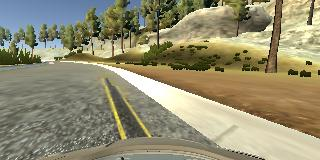
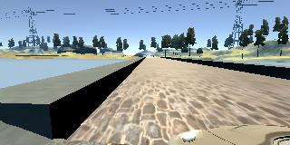
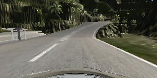

## Behaviorial Cloning, Project 3

#### Contents include:

* model.py: code for training the model; using python 3.6, keras 1.2.1  
* drive.py: Udacity provided script to drive the car in autonomous mode
* model.h5- a trained Keras model
* writeup.md - a report writeup file
* video.mp4 - a video recording of the simulator vehicle driving autonomously 

#### Goals 
* Use the simulator to collect driving behavior data
* Build, a convolution neural network in Keras that predicts steering angles from driving images
* Train and validate the model with a training and validation set
* Test that the model successfully drives around track one without leaving the road
* Summarize the results with a written report

#### 1. Model Architecture 

The architecture used was adapted from a former Udacity student's Tensorflow architecture used in the [Traffic Sign Classifiers project](https://github.com/jeremy-shannon/CarND-Traffic-Sign-Classifier-Project/blob/master/Traffic_Sign_Classifier.ipynb)

It uses three convolutional layer, concatenates the output of layer 2 and layer 3, and feeds them into a singer linear layer. Relus and Max Pooling are used after the first two convolutionals. 

| Layer No  | Functions     |Dimensions                                   |
|-----------|---------------|---------------------------------------------|
|Layer1:    |Conv           |kernel = 3x3, strides = 2 |
|           |Relu      |                                             |
|           |Max_Pool       |kernel = 3x3, strides = 2                  |
|Layer2:    |Conv           |kernel = 5x5, strides = 1 |
|           |Relu        |                                             |  
|           |Max_Pool       |kernel = 2x2, strides = 3 |
|Layer3:  |Conv           |kernel = 5x5, strides=2   |
|Flatten:    |Merge of Layer 3 and Layer 2 MaxPool |                    |    
|Layer4:    |Fully Connect  |                       |

#### Data Collection 

The original data used for training and validation included two passes around the track (counter-clockwise) of straight line driving and one pass of straight line driving around the track in the opposite directon (clockwise). This resulted in autonomous driving that tended veer off the track on longer, tighter curves and at key locations (such as bridges and the "dirt pull-off"). To combat this, additional data was collected which included

  1) data that continously veered toward the curbs around the track and "jerked" back to the center of the track; and  
  2) data that repeatedly veered toward those key locations (bridge, dirt pull-off) and "jerked" back to the center of the track. 
  
This helped train the model to avoid driving off of and into these key locations. However, the car tended to drive up onto and along the curb. 

##### Fig 1. Car Veering Toward Curb

##### Fig 2. Car Approaching Bridge

Finally, data was collected driving along the second track, one time around, in both directions. This seemed to corrected the curb-driving behavior. 

##### Fig 3. Image of Second Track

The data was normalization according to the equation ( img/255 - 0.5 ). Images were cropped by 50 rows from the top and 20 rows from the bottom. Only center camera angles were used. The data was shuffled and 20% of the data was split apart and used for validation, while the remaining 80% was used for training.

The model was trained for 5 epochs, loss was calculated using MSE.  

