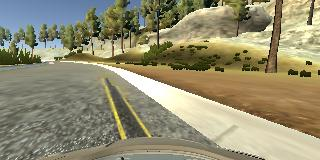
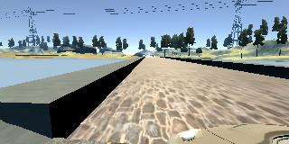
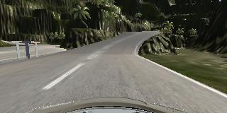

# **Behavioral Cloning**
## **Project 3 Udacity Self-Driving Car Nanodegree** 

## Writeup
---

### Goals 
* Use the simulator to collect driving behavior data
* Build, a convolution neural network in Keras that predicts steering angles from driving images
* Train and validate the model with a training and validation set
* Test that the model successfully drives around track one without leaving the road
* Summarize the results with a written report

---
### Files Submitted & Code Quality

#### 1. Included Files for Submission

This project includes the following files:
* model.py containing the script to create and train the model
* drive.py for driving the car in autonomous mode
* model.h5 containing a trained convolution neural network 
* writeup_report.md summarizing the results

#### 2. Submission includes functional code
Using the Udacity provided simulator and my drive.py file, the car can be driven autonomously around the track by executing 
```sh
python drive.py model.h5
```

#### 3. Submission code is usable and readable

The model.py file contains the code for training and saving the convolution neural network. The file shows the pipeline I used for training and validating the model, and it contains comments to explain how the code works.

### Model Architecture and Training Strategy

#### 1. Model Architecture 

The architecture used was adapted from a former Udacity student's Tensorflow [Traffic Sign Classifiers project](https://github.com/jeremy-shannon/CarND-Traffic-Sign-Classifier-Project/blob/master/Traffic_Sign_Classifier.ipynb)- itself an adaptation of Sermanet/LeCunn classifier. It uses three convolutional layer and a singer linear layer. After the first two convolutional layers, the outputs are passed through a Relu and a MaxPooling node. The output of the third convolution is flattened and concatenated with the flattened output of the second max pool. This is then passed through a single linear layer. 


| Layer No  | Functions     |Dimensions                                   |
|-----------|---------------|---------------------------------------------|
|Layer1:    |Conv           |kernel = 3x3, strides = 2 |
|           |Relu      |                                             |
|           |Max_Pool       |kernel = 3x3, strides = 2                  |
|Layer2:    |Conv           |kernel = 5x5, strides = 1 |
|           |Relu        |                                             |  
|           |Max_Pool       |kernel = 2x2, strides = 3 |
|Layer3:  |Conv           |kernel = 5x5, strides=2   |
|Flatten:    |Merge of Layer 3 and Layer 2 MaxPool |                    |    
|Layer4:    |Fully Connect  |

An adaptation of the Nvidia architecture discussed in class was tested however the training and validation losses were much higher that the architecture described above, therefore it was not used. 

For parameter tuning the Adam optimizer was used to automatically adjust the learning rate. Epoches were adjusted such that the Validation Loss was near it's lowest value, at 5 epochs (see Model Fitting below). 

Softmax activation functions were tested instead of Relu's, usng various epochs (5,10,15) and testing with and without dropouts, this generally resulting in underfitting and poor autonomous driving. 

#### 2. Data Collection, Preprocessing, and Training Strategy

The original data used for training and validation included two passes around the track (counter-clockwise) of straight line driving and one pass of straight line driving around the track in the opposite directon (clockwise). This resulted in autonomous driving that tended veer off the track on longer, tighter curves and at key locations (such as bridges and the "dirt pull-off"). To combat this, additional data was collected which included

  1) data that continously veered toward the curbs around the track and "jerked" back to the center of the track; and  
  2) data that repeatedly veered toward those key locations (bridge, dirt pull-off) and "jerked" back to the center of the track. 
  
This helped train the model to avoid driving off of and into these key locations. However, the car tended to drive up onto and along the curb. 

##### Fig 1. Car Veering Toward Curb


##### Fig 1. Car Approaching Bridge



Finally, data was collected driving along the second track, one time around, in both directions. This seemed to corrected the curb-driving behavior. 

##### Fig 3. Image of Second Track


For data preprocessing normalization was used via the Lamdba() function using the equation (img/255 - 0.5), as suggested in lecture. Images were cropped by 50 rows from the top and 20 rows from the bottom, also suggested in lecture. Additional preprocessing methods were tested (converting to gray-scale and Canny edge detection) however this methods did not improve the model. 

The data was shuffled and 20% of the data was split apart and used for validation, while the remaining 80% was used for training.

#### 2. Model Fitting

Loss was determined using Mean Squared Error. At about 5 epochs the training loss and validation loss were relatively close, with a training to validation loss ratio of 0.448 (where 1.0 would be equal, and a ratio > 1.0 would indicate underfitting the model). This keep the car on the track. 

The model was trained using dropouts after the second layer, after the third layer (immediately before the linear layer), and after both the second and third layers using keep probablities of 0.8 and 0.5. Epochs with the various dropout combinations were tested at 5,7,10,15. These did not appreciably improve overfitting, and autonomous driving was worse (the car always drove off of the track). Therefore dropouts were not used in the final model. 
